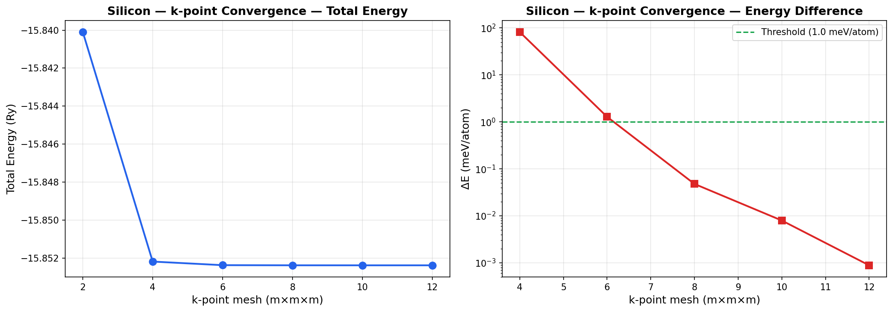
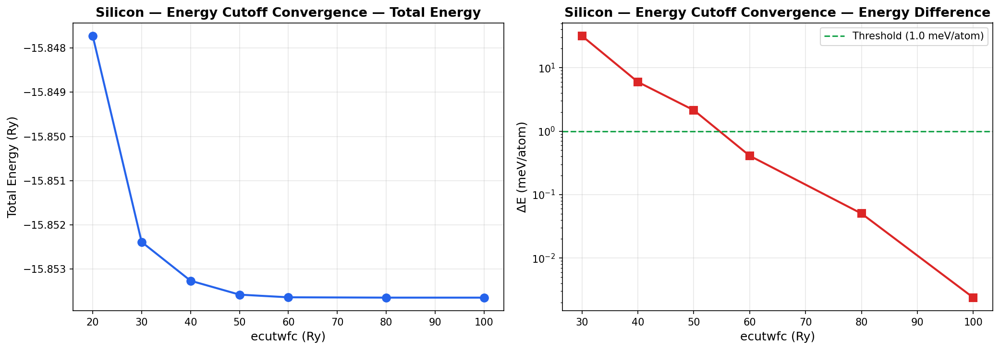
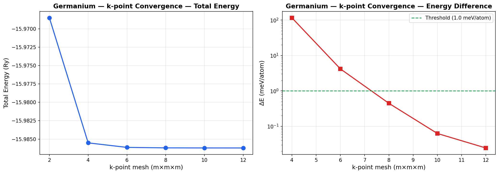
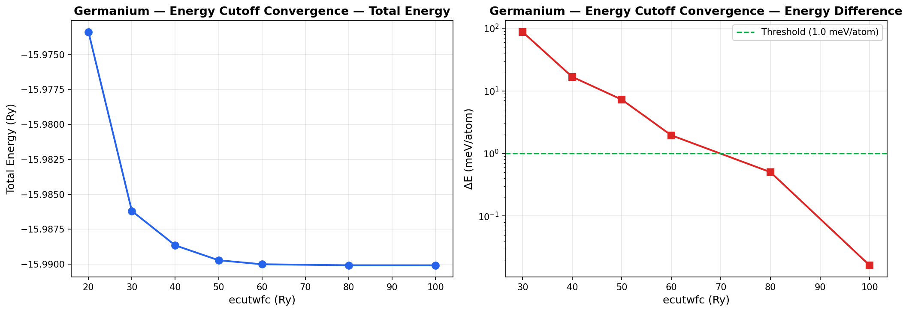

# DFT Convergence Study: Silicon and Germanium

A systematic Density Functional Theory (DFT) convergence study for crystalline Silicon (Si) and Germanium (Ge) in the diamond cubic structure, performed using [Quantum ESPRESSO](https://www.quantum-espresso.org/).

## Objective

Determine the optimal computational parameters (k-point mesh and plane-wave energy cutoff) for accurate DFT calculations of Si and Ge, and compare their convergence behavior.

## Method

- **Code:** Quantum ESPRESSO 7.2 (`pw.x` for SCF, `pp.x` for post-processing)
- **Pseudopotentials:** `Si.pz-vbc.UPF` (norm-conserving, LDA), `Ge.pz-hgh.UPF` (norm-conserving, LDA)
- **Structure:** Diamond cubic (ibrav=2), 2 atoms/cell
- **Lattice parameters:** Si: celldm(1) = 10.2 a.u., Ge: celldm(1) = 10.7 a.u.
- **Convergence threshold:** SCF conv_thr = 1.0×10⁻⁸ Ry
- **Convergence criterion:** ΔE < 1 meV/atom between successive parameter values

### Convergence procedure
1. **K-point convergence:** Vary Monkhorst-Pack grid (2×2×2 through 12×12×12) at fixed ecutwfc = 30 Ry
2. **Energy cutoff convergence:** Vary ecutwfc (20–100 Ry) at fixed converged k-point mesh (8×8×8)
3. **Visualization:** Generate charge density and ELF (Electron Localization Function) XSF files for VESTA

## Results

### Silicon

#### K-point Convergence

| k-mesh  | Total Energy (Ry) | ΔE (meV/atom) |
|---------|-------------------|----------------|
| 2×2×2   | -15.84009484      | —              |
| 4×4×4   | -15.85219079      | 82.3           |
| 6×6×6   | -15.85237974      | 1.28           |
| 8×8×8   | -15.85238677      | 0.048          |
| 10×10×10| -15.85238794      | 0.008          |
| 12×12×12| -15.85238807      | 0.001          |

**Converged at 6×6×6** (ΔE < 1 meV/atom). Used 8×8×8 for cutoff study as a safe choice.



#### Energy Cutoff Convergence (k = 8×8×8)

| ecutwfc (Ry) | Total Energy (Ry) | ΔE (meV/atom) |
|-------------|-------------------|----------------|
| 20          | -15.84772470      | —              |
| 30          | -15.85238677      | 31.7           |
| 40          | -15.85326300      | 5.96           |
| 50          | -15.85357759      | 2.14           |
| 60          | -15.85363775      | 0.41           |
| 80          | -15.85364515      | 0.050          |
| 100         | -15.85364550      | 0.002          |

**Converged at 60 Ry** (ΔE < 1 meV/atom).



### Germanium

#### K-point Convergence

| k-mesh  | Total Energy (Ry) | ΔE (meV/atom) |
|---------|-------------------|----------------|
| 2×2×2   | -15.96850998      | —              |
| 4×4×4   | -15.98551352      | 115.7          |
| 6×6×6   | -15.98612718      | 4.17           |
| 8×8×8   | -15.98619274      | 0.45           |
| 10×10×10| -15.98620196      | 0.063          |
| 12×12×12| -15.98620555      | 0.024          |

**Converged at 8×8×8** (ΔE < 1 meV/atom). Ge requires a slightly denser mesh than Si.



#### Energy Cutoff Convergence (k = 8×8×8)

| ecutwfc (Ry) | Total Energy (Ry) | ΔE (meV/atom) |
|-------------|-------------------|----------------|
| 20          | -15.97338613      | —              |
| 30          | -15.98619274      | 87.1           |
| 40          | -15.98865488      | 16.7           |
| 50          | -15.98972058      | 7.25           |
| 60          | -15.99000721      | 1.95           |
| 80          | -15.99008113      | 0.50           |
| 100         | -15.99008353      | 0.016          |

**Converged at 80 Ry** (ΔE < 1 meV/atom). Ge requires a higher cutoff than Si (80 vs 60 Ry) to reach the same tolerance. This is expected because Ge has more electrons and a larger atomic core, requiring more plane waves to describe the wavefunctions accurately with the HGH pseudopotential.



### Si vs Ge Comparison

| Parameter        | Silicon     | Germanium   |
|-----------------|-------------|-------------|
| Converged k-mesh | 6×6×6       | 8×8×8       |
| Converged ecutwfc| 60 Ry       | 80 Ry       |
| Lattice param    | 10.2 a.u.   | 10.7 a.u.   |

**Key observations:**
- Ge converges slightly slower in both k-points and energy cutoff compared to Si.
- The k-point convergence difference is modest (6 vs 8), reflecting Ge's slightly larger unit cell and similar Brillouin zone topology.
- The energy cutoff difference is more pronounced. Ge's larger atomic number means its pseudopotential has harder features, requiring more plane waves.
- Both materials show the same diamond cubic bonding pattern in ELF visualization, with electron localization along the tetrahedral bond directions. Ge shows slightly more diffuse bonding electrons, consistent with its weaker covalent bonds and smaller band gap.

## Visualization

VESTA XSF files are provided for both Si and Ge:
- `Si/visualization/Si_rho.xsf` — Silicon charge density
- `Si/visualization/Si_elf.xsf` — Silicon Electron Localization Function
- `Ge/visualization/Ge_rho.xsf` — Germanium charge density
- `Ge/visualization/Ge_elf.xsf` — Germanium Electron Localization Function

Open in [VESTA](https://jp-minerals.org/vesta/) → Properties → Isosurfaces → try ELF levels 0.7–0.85.

## Project Structure

```
dft-convergence-study/
├── README.md
├── pseudo/                     # Pseudopotential files (UPF)
├── Si/
│   ├── kpoints/                # K-point convergence input/output files
│   ├── cutoff/                 # Energy cutoff convergence input/output files
│   └── visualization/          # SCF + pp.x for VESTA XSF files
├── Ge/
│   ├── kpoints/
│   ├── cutoff/
│   └── visualization/
├── results/                    # CSV data files
├── plots/                      # Convergence plots (PNG)
└── scripts/                    # Python plotting script
```

## How to Reproduce

1. Install Quantum ESPRESSO 7.2+ (see `install_qe.sh` in parent directory)
2. Run any `.in` file: `pw.x -in scf_k04.in > scf_k04.out`
3. Extract energies: `grep "!" scf_k04.out`
4. Generate plots: `python3 scripts/plot_convergence.py`

## Tools

- Quantum ESPRESSO 7.2 (pw.x, pp.x)
- Python 3 + matplotlib (plotting)
- VESTA (3D visualization)
- WSL2 / Ubuntu 24.04
